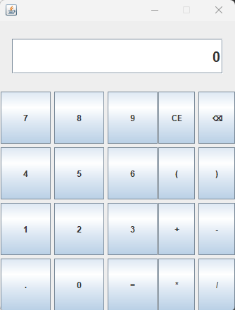

 

  

  <h3 align="center">READ ME</h3>

  

    PTPC(Project To Practice Coding)
     
    <a href="https://github.com/RRosario007/PTPC"><strong>Explore the docs »</strong></a>
  

  
Table of Contents

  <ol>
    <li><a href="#about-the-project">About The Project</a></li>
    <li> <a href="#calculator">Calculator</a> </li>
    <li><a href="#web-page">Web Page</a></li>
    <li><a href="#copy-playlist-program">Copy Playlist Program</a></li>
  </ol>

## About The Project
In this project, I've created multiple programs in order to practice my programming skills. The programs I've created so far are a calculator, a website, and a copy playlist program. All of my coding is not upto par with an efficien program and definitely has some mistakes, but by doing this I hope to become a pragmatic programmer. On top of that, I can look back at my code later and realize some of the mistakes I've made.

 
 
 
 
 
 
 

 

(<a href="#readme-top">back to top</a>)

## Calculator

  

This is just a simple calculator program. I started coding the logic of the calculator first, then I worked on the user interface.
 
Things I learned:

* The importance of planning before starting to program
* JSwing
* The importance of comments for when your revisit the program and for others to understand.

 
 
 
 
 
 
 
 

(<a href="#readme-top">back to top</a>)

## Web Page
I created my own web page. It includes my work, how to contact me, and info about me. I got inspiration from La La Land for the color palette.
 
Things I learned:

* HTML & CSS
* The importance of creating a drawing of a website first in order to have a general idea of where things are going to go
* Picking a good color palette so that the website is something you want to look at

 
 
 
 
 
 
 
 
 

(<a href="#readme-top">back to top</a>)

## Copy Playlist Program
I created a algorithm that uses web scraping in order to obtain the name and artist from a playlist on Apple Music and store it in a text file. 
Then I used selenium in order to find the songs on Youtube and add the song to a playlist on Youtube.
 
Things I learned:

* Beautiful Soup
* Selenium

